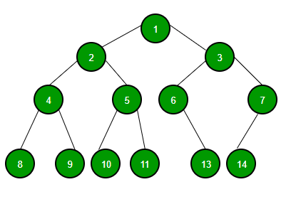

# Heap Sort

Before understanding the behavior of this sorting algorithm, we must first understand what the heap data structure of is. This data structure treats the input array as a graph, more specifically as a binary tree, this type of graph has some interesting features:

- Each node has only two child nodes, so this structure is called **"binary tree"**.
- For each node C, we have a parent node P. The key value of P is greater than or equal to the key value of C. Therefore, in this structure, we can guarantee that the largest element of the array will be the key value of the top root node. This means the element of the index array[0].
- The algorithm treats the matrix as a tree, using the index of positions within the matrix as a reference. For example, the element array[0] is the root of all elements. The children of the array[0] will be the element in positions 1 and 2 - array[1] and array[2] - and so on, the children of the array[1] have indexes 3 and 4, the children of the array[2] have indexes 5 and 6. We can describe this relationship mathematically.

Let p be the index position of the parent node P, the indexes of the positions of its children will be given by the formulas: f1 = 2 * p +1 and ef2 = 2 * p + 2.

* After exposing these concepts, we can now analyze how the * heap-sort * algorithm works. The algorithm first transforms the input array into a heap data structure using the auxiliar heapfy function. After that, because we already know a little about what a heap structure is, we also know that the first element of our set, with this, I am referring to the element of index 0, array[0], has the highest key value among all the elements of the input array. So, since we want to sort the elements in the array, we just need to place it in the rightmost position of the array.

To do what was said, the algorithm exchanges the key values ​​of the first index, 0, with the key value of the index m-1, where m represents the size of the input array. After that, the set probably no longer respects the structure of a heap so we need to turn the array back into a heap by calling the heapfy function again. The function is called inside a loop, the first call is at the root node, then we call the function again for each child node and continue doing this until the end of the tree. If in the middle of the process, the algorithm exchanged the key values ​​of two nodes, the algorithm must call the function again to ensure that the exchange has not changed the data structure.

We have two approaches to the heapfy function, we could do recursion or we can also write the function code using an iterative method. After running both examples, we can see that the iterative function performs more comparisons due to an extra 'while' loop, but this does not have significant impacts on the performance of the algorithm, on the contrary, we can see that the two versions have quite similar performances for the average case of a random array.
