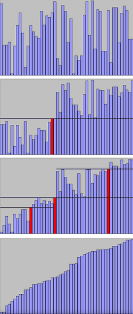

# Quick Sort

The quick sort algorithm, as we have seen with the merge, is also a **divide and conquer** algorithm, first let's talk about the history of this example, my major source of information was wikipedia and my classes at the University of São Paulo (USP) and its bibliography (**"Introduction to Algorithms"-Third Edition, Thomas H. Cormem)**).

This sorting algorithm was first developed by a British computer scientist *Sir Charles Antony Richard Hoare* in the 1950s, while Hoare was in the Soviet Union as a visiting student at **Moscow State University**. In fact, he was looking for an algorithm to help him solve a linguistic problem, he wanted to develop a program that would classify words in Russian sentences and assist him in the ultimate goal of creating an algorithm that should look for words in a Russian-English dictionary.

The algorithm starts by choosing a *pivot element* and then the program separates the input array into two unclassified sub-arrays, the first to the left of the pivot position, the algorithm will place there all elements with a value less than the value of pivot; the second sub-array is to the right of the pivot position and the algorithm places all elements that have values ​​greater than the pivot value there. As mentioned earlier, quickSort uses the divide and conquer methodology, so the code will call the quick sort function recursively for each sub-array and will continue to do this repeatedly until we have blocks of size 2 and then order them all together.

The algorithm gets this name *Quick Sort*, because it is recognized as the fastest among the others we have seen so far, because most programming languages ​​already have standard functions implemented in their libraries, C also has this feature, the header *stdlib* contains the function *qsort ()*. My idea was to compare my implementation to the standard and, of course, the standard had shown the best results. And their results where faster than the other algorithms that I analyzed before (my personal function did not reach these values, I assume, after analyzing with valgrind, that there were problems with the swap function and also with the recursive call of the quickSort function). 
